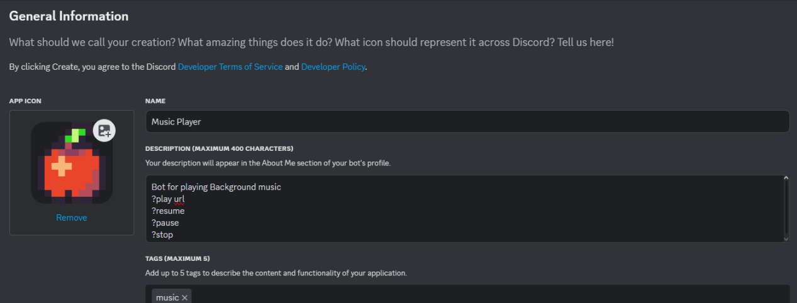
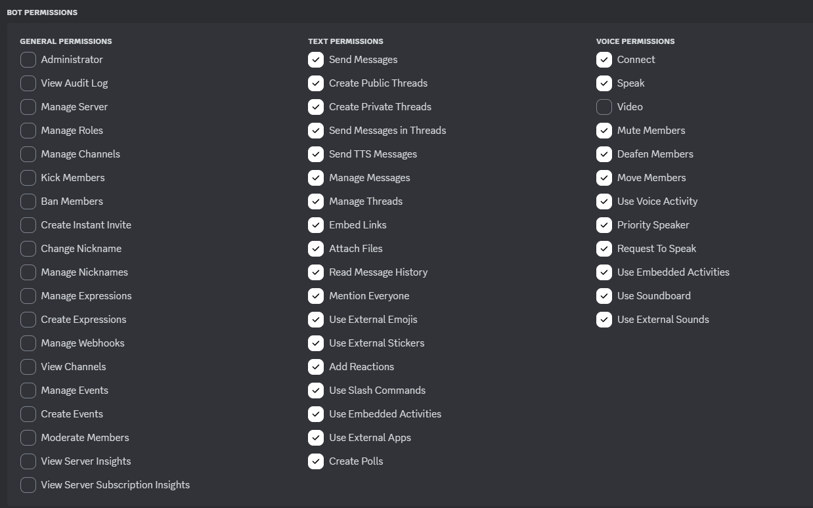
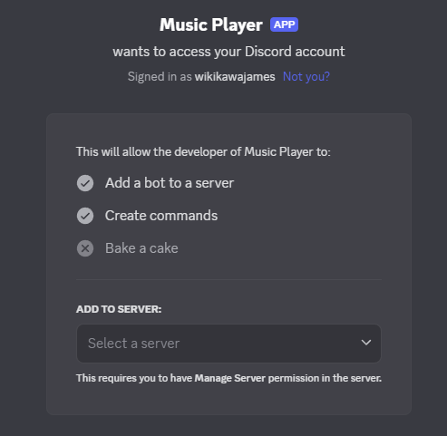
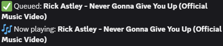

# Discord YouTube Music Bot

A lightweight, Python-based music bot for Discord that plays audio from YouTube using `yt-dlp`, `ffmpeg`, and `discord.py`. It supports queueing, skipping, pausing, resuming, and looping.

> ⚠️ This bot runs on your local machine — you must keep the script running for the bot to stay online.

---

## 🎧 Features

- Play songs using YouTube search or direct links
- Pause, resume, skip, and stop music
- View the current queue
- Loop the currently playing song
- Filters out YouTube livestreams to avoid crashes

---

## ⚙️ Setup Instructions

### 1. Clone the Repository

```bash
git clone https://github.com/JamesVhal/discord-youtube-bot
```

---

### 2. Create a Virtual Environment (Recommended)

**Windows:**

```bash
python -m venv venv
venv\Scripts\activate
```

**macOS/Linux:**

```bash
python3 -m venv venv
source venv/bin/activate
```

---

### 3. Install Dependencies

```bash
pip install -r requirements.txt
```

> Make sure you have `ffmpeg` installed and available in your system PATH.

---

### 4. Create a Discord Application

1. Visit: [https://discord.com/developers/applications](https://discord.com/developers/applications)
2. Click **New Application**, give it a name, and click **Create**

#### 📌 General Information

- Add a description and profile image
- Save your changes



---

### 5. Add the Bot

1. Go to the **Bot** tab
2. Click **Add Bot**
3. (Optional) Uncheck "Public Bot" to limit it to your server
4. Click **Reset Token** and **Copy** your bot token

Paste the token into a file named `.env` like this:

```env
discord_token=YOUR_DISCORD_BOT_TOKEN
```

> ❗ **Never share your token publicly.** It gives full control of your bot.

---

### 6. Invite the Bot to Your Server

1. Go to the **OAuth2 > URL Generator** tab
2. Under **Scopes**, check `bot`
3. Under **Bot Permissions**, check:

   - Connect
   - Speak
   - Send Messages
   - Embed Links (optional)
   - Read Message History (optional)



4. Copy the generated link, paste it into a browser, and invite your bot



---

### 7. Run the Bot

```bash
python main.py
```

You should see:

```
BotName is connected and ready!
```

---

## ✅ Commands

| Command               | Action                         |
| --------------------- | ------------------------------ |
| `?play <name or URL>` | Play a song from YouTube       |
| `?pause`              | Pause playback                 |
| `?resume`             | Resume playback                |
| `?stop`               | Stop playback and disconnect   |
| `?skip`               | Skip to the next song          |
| `?loop`               | Toggle looping of current song |
| `?queue`              | Display current song queue     |
| `?nowplaying`         | Show currently playing track   |

---

## 📂 Project Structure

```
discord-music-bot/
├── bgmusic.py         # Main bot script
├── .env               # Secret token file (do not share)
├── .gitignore         # Ignore .env and __pycache__
├── requirements.txt   # Project dependencies
├── README.md          # Setup instructions (this file)
└── assets/            # Images for the README
```

---

## 🖼 Demo

> Add a screenshot or GIF of the bot running here



---

## 🙋 Author

**James Hamm**  
[GitHub](https://github.com/JamesVhal)
