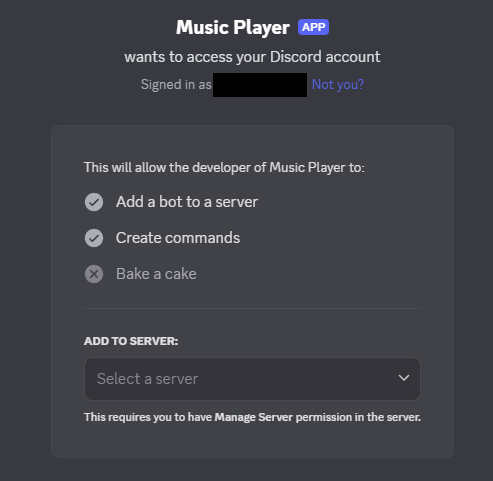

# Discord Youtube Music Bot

A lightweight Python music bot for Discord using yt-dlp + ffmpeg + discord.py.

## Features

- Play songs from YouTube via search or URL
- Pause, resume, skip, and loop songs
- Simple queue system

...

## Instructions

1. go to https://discord.com/developers/applications

- Log into your discord account and create New Application on the applications page
- Name however you like and click create

2. Set up general information

- Description is the bio on the player so put commands and such there for people to see
- Set a profile image as you'd like
- Once done save your changes
  

3. Go to the Bot tab on the left

- Confirm it has the username and icon you want
- Uncheck Public so others can't invite your bot to their servers
- There is a Token setting where you'll want to click reset token or copy
- Once you have the token, do not share it. Put it in your .env file where PLACEHOLDER is.

4. Inviting to Server

- Go to OAuth2 tab on the left
- under OAuth2 URL Generator select bot
- A bot permissions box should appear and set these settings
  
- feel free to remove some, I just leave these since it is your own bot
- Once done, copy the generated URL at the bottom and paste it into a new tab
  

5. Enjoy the bot!
   Commands are:
   ?play url (or name of song)
   ?resume
   ?pause
   ?stop
   ?loop
   ?skip
   ?queue

   Note:
   This bot does run off your own computer so you'll need to run the main to start it up
   and then you can talk to it in discord
   Bot should say "name" is connected and ready!
